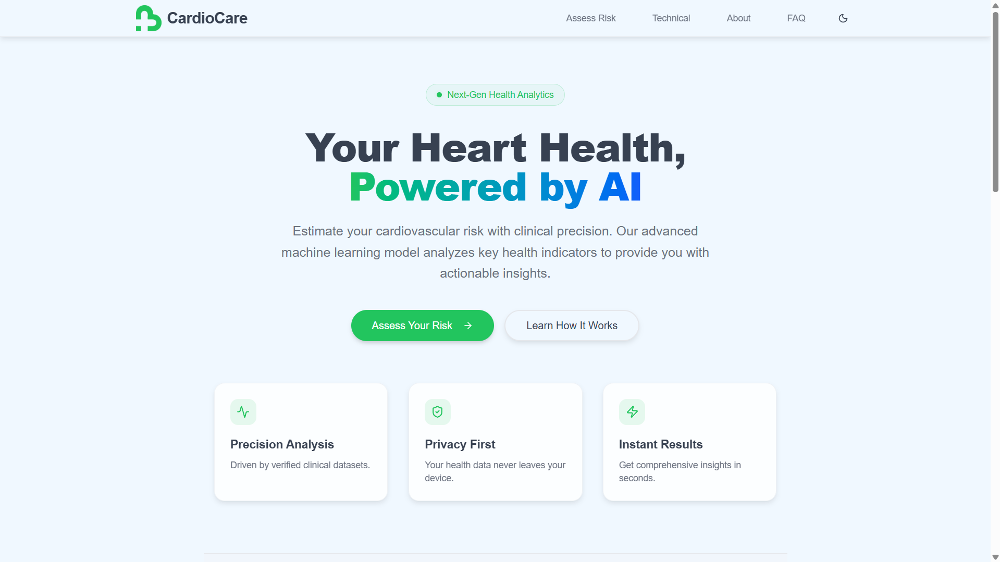
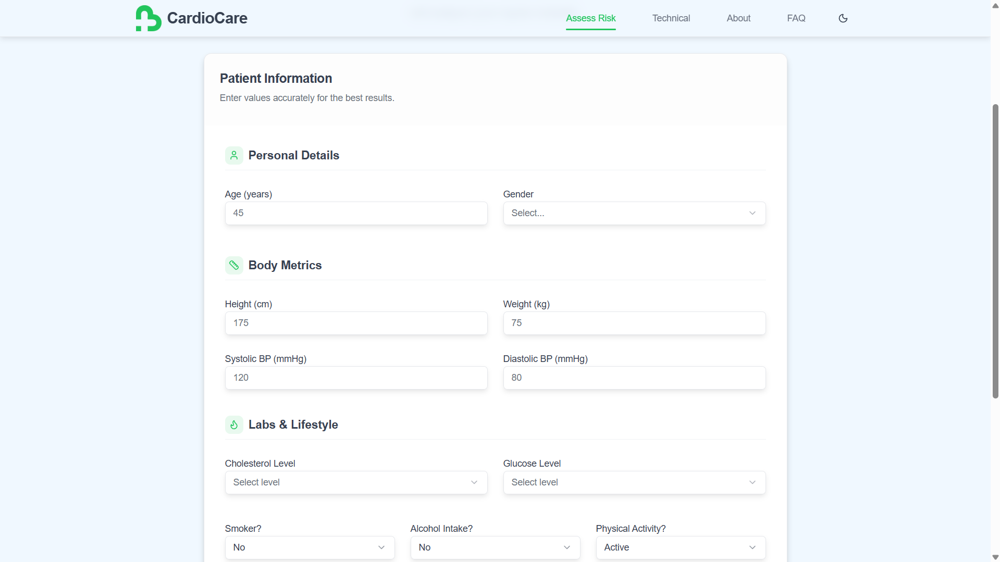
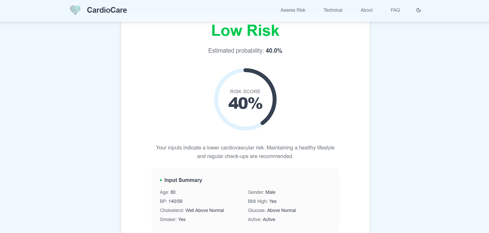

# CardioCare ❤️
### AI-Powered Heart Disease Risk Assessment System


**CardioCare** is a modern, responsive web application designed to bridge the gap between advanced machine learning and daily health awareness. It allows users to estimate their cardiovascular risk profile instantly using a clinical-grade AI model.

---

## 🚀 Key Features

*   **🤖 Real-Time AI Analysis**: Integrates with a Python-based backend (KNN Model) to provide instant risk assessments based on 12 key health indicators.
*   **📊 Interactive Data Visualization**: Features dynamic graphs and charts to explain medical data and risk factors clearly.
*   **🎨 Premium UI/UX**: Built with **Shadcn/UI** and **Tailwind CSS**, offering a sleek, glassmorphism-inspired design with smooth **Framer Motion** animations.
*   **📱 Fully Responsive**: Optimized for all devices, from desktop monitors to mobile phones, with a native-app-like feel.
*   **🌙 Dark Mode Support**: seamless theme switching for comfortable viewing in any environment.
*   **📄 PDF Reports**: Users can generate and download a detailed medical report of their assessment.

---

## 🛠️ Technology Stack

### Frontend
*   **Framework**: React.js (Vite)
*   **Styling**: Tailwind CSS
*   **Components**: Shadcn/UI, Lucide React (Icons)
*   **Animations**: Framer Motion
*   **Routing**: React Router DOM

### Backend (Integrated)
*   **Model**: K-Nearest Neighbors (KNN)
*   **Training Data**: 70,000+ Clinical Patient Records
*   **API**: RESTful endpoint hosted on Render

---

## 📸 Screenshots

### Landing Page


<br />

### Functionality
| Risk Assessment Form | Analysis Result |
|:---:|:---:|
|  |  |

---

## 🏃‍♂️ Getting Started

1.  **Clone the repository**
    ```bash
    git clone https://github.com/dev-Jigar05/CardioCare-frontend.git
    cd CardioCare-frontend
    ```

2.  **Install dependencies**
    ```bash
    npm install
    ```

3.  **Run the development server**
    ```bash
    npm run dev
    ```

---

## ⚕️ Disclaimer
*CardioCare is an educational tool based on statistical patterns. It is not a diagnostic device. Always consult a healthcare professional for medical advice.*
